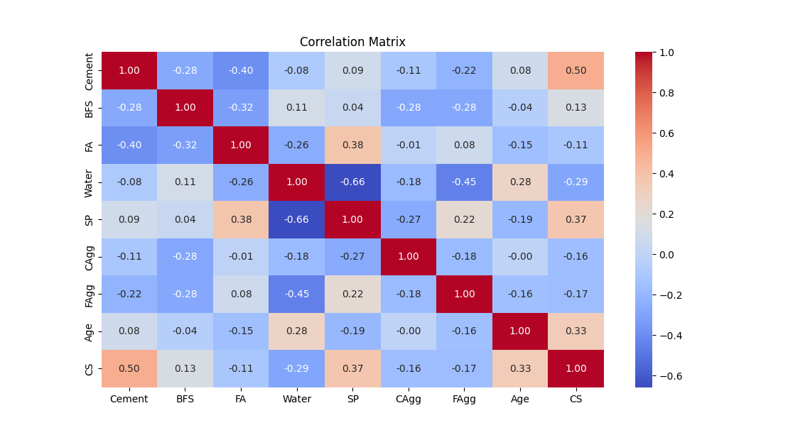

# Overview

The goal is to build a neural network to predict the compressive strength (CS) of concrete based on various features of the concrete mix. This project involves analyzing correlation matrix, getting rid of outliers, preprocessing the data, creating interaction terms, augmenting the data, and training  a neural network model.

# Correlation Matrix Analysis

It is evident that 'Cement', 'SP', 'Age', and 'Water' have a significant impact on the target variable, i.e., CS. Although the other features do not directly affect the target, they have a strong relationship with those that do. In other words, there are internal relationships. Therefore, instead of adding these low-impact features directly to the training, their interaction features will be added.

# Handling Outliers

- In each column, values are clipped to be within the 5th and 95th percentiles. This basic and smooth method is chosen to handle outliers, as extreme values can occur in real life, and the model should be prepared to make predictions on them as well.

# Preprocessing and Feature Engineering
    
- Features that have a significant relationship with the target are separated.
- Interaction features are created using features that have a low impact on the target but a high impact on features that significantly affect the target. Each interaction feature is created only with the features that significantly affect each other.
- Features that have a significant relationship with the target and the interaction features are combined.
- A logarithmic transformation is applied to the target.
- Input features are standardized by subtracting the mean from the actual value and dividing by the standard deviation (X = (X - X_mean) / X_std).
- Data is augmented with Gaussian noise. The number of augmentations is set to 2, and the noise level is set to 0.02.
- Both the original data points and the augmented data points are combined.
- Data points are split into training and testing sets, with the test size set to 0.2.

# Building The Model

- A sequential model is built.
- In this model, three 'Dense' layers are used, each with 256 neurons, except for the output layer, which has 1 neuron since the prediction will be a single value.
- To prevent overfitting and ensure a smooth training process, two 'Dropout' layers are used, each with a rate of 0.2, and an L2 kernel regularizer with a factor of 0.001 is applied to each layer.
- The 'ReLU' activation function is added to each layer except the output layer.

# Compiling The Model

- Stochastic Gradient Descent (SGD) is used as the optimizer with a learning rate set to 0.01, which is 10 times faster than the default learning rate. The momentum is set to 0.9. Mean Squared Error (MSE) is used as the loss function.

# Training The Model

- The 'EarlyStopping' callback is implemented to stop training in case of overfitting. The patience is set to 10, and the 'restore_best_weights' flag is set to true.
- The 'ReduceLROnPlateau' callback is implemented to reduce the learning rate when the model stops improving. The monitored value is 'val_loss', the factor is set to 0.1, and the patience is set to 5.
- 150 epochs are used in the training process.
- The batch size is set to 16.
- Validation split is applied with a value of 0.3.

# Evaluation and Manuel Test

- There were no signs of overfitting or underfitting.
- The test loss is 0.02, which is exceptionally low.
- A manual test is done with a separate test set. The R^2 score returned from the test results is 0.91, suggesting that the model is explaining a large portion of the variance in the real values.